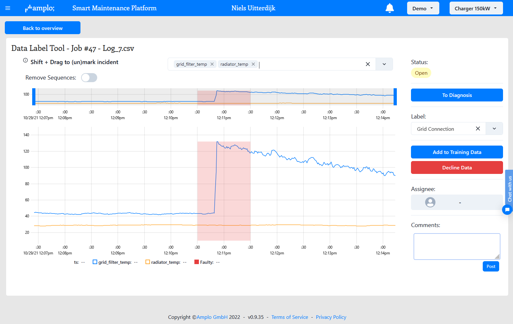
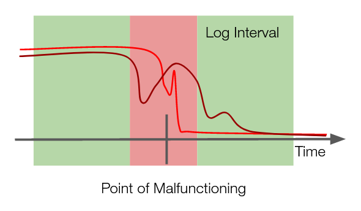

# Labelling Predictions

Though all your measurement data is organised by [Services](../Educational/Services.md) and Incident, some log files deserve further attention before you start [Training](Training.md) models:

* Long [Automated Diagnostics](../Educational/Services.md#automated-diagnostics) logs (>5s)
* [Predictive Maintenance](../Educational/Services.md#predictive-maintenance) logs

### Labeling Automated Diagnostics Logs

[Amplo's AutoML](https://github.com/amplo-gmbh/automl) has an interval analyser that identifies incident data within a log file, even when there is also healthy data in that log file. Yet, in some cases, it may help to manually label the interval where the failure is present in the data. This will result in the labelled data being included, while the unlabelled part will be excluded during training.

You can open the label interface shown in the picture below from the [Data](Data.md) or from a [Label Jobs](Labelling.md#label-jobs).

* Use the select bar above the graph to (de)select the columns shown in the graph.
* Use the brush to scroll through the timeline of the log.
* Double-click on the graph to show the entire timeline.
* Hold shift and drag from left to right to mark a faulty interval.
* With the top left

Always ensure to capture the incident interval where the incident is most obvious from the data!

### Labeling Predictive Maintenance Logs

Predictive Maintenance predicts not only the probability of a specific incident, also the timing of when such incident is most-likely to occur. In order to do so, we need to train the models how far away the incident is at any given point in time. Therefore, it's important to label the deterioration from start to end. Instead of marking the incident interval, you can drag the deterioration from 0% to 100% over the timeline.

### Label Jobs

The true state of the machine is unknown for every Alert & Diagnosis.\
To ensure optimal predictions, it is important to provide feedback to the ML models about their predictions. With Amplo, you can label every alert and diagnosis. To ensure the corresponding data is added to the training data, you follow a two-step approach:

1. The ticket owner, who sends out the work order and resolves the incident, labels the prediction once the incident is confirmed. Upon labeling the prediction, a `Label Job` is created.
2. A data labeler (often a Senior Service Engineer), gets assigned to verify and confirm the Label Job. Here, he/she can mark the interval for Automated Diagnostics Tickets or the Incident Deterioration for Predictive Maintenance Tickets. Once the labeler approves the Label Job, the measurement data is added into the training data.

> _**NOTE:**_ Only after the Label Job is approved, will the measurement data enter the training data!
